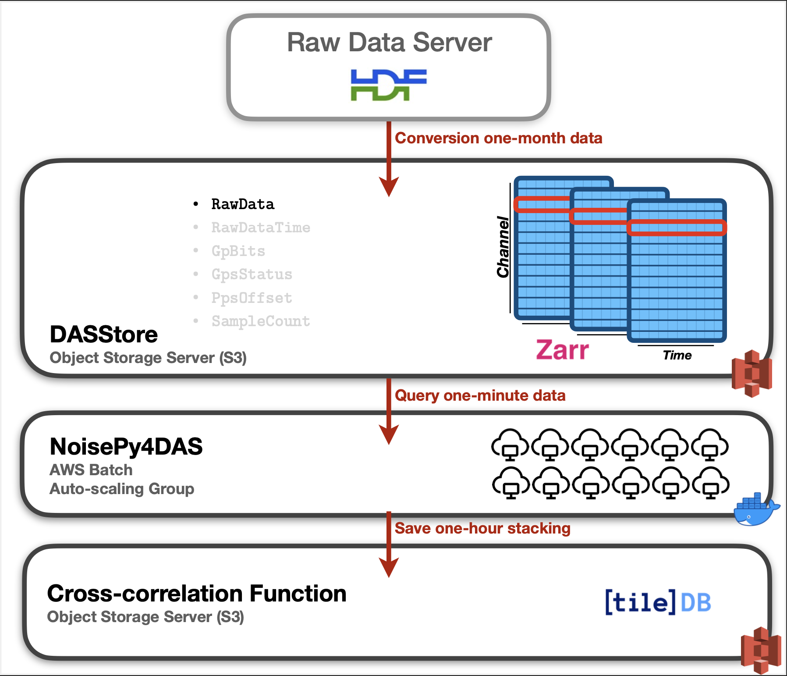

# NoisePy/SeaDAS/DASstore cross-correlation project
## Ambient noise cross-correlation of DAS data on AWS cloud



## The Data: SeaDAS-N
We take the example of the SeaDAS-N DAS recording that occurred between April 2022 and March 2023 by the [UW Photonic Sensing Facility](https://psf.uw.edu). The dark fiber used is owned by the UW and runs from the Atmospheric and Geophysics building, room 211 to the UW Bothell campus. The fiber runs mostly underground but has above-ground sections we detected using Distributed Temperature and Strain Sensing. The data was collected using an Onyx Sintela interrogator with channels every 10 meters and ~2000 channels, a sampling rate of 200Hz.

## The Storage platform: DASstore
We host our DAS data in DASstore, a new storage solution for distributed acoustic sensing (DAS) data. We introduce object storage that has been widely used in commercial cloud storage (AWS S3, Azure Blob, etc.) to a local data server. Instead of hosting data in the HDF5 format, we proposed hosting DAS data in the Zarr format that is optimized for cloud environment. See [this repo](https://github.com/niyiyu/DASstore) for more information.

## The Tool: NoisePy4DAS
We use a modified version of [NoisePy](https://github.com/mdenolle/NoisePy) to implement the cross-correlation operation. The package is containerized into Docker image and hosted on GitHub that can is publically available from Cloud platform.

## AWS Batch for massive parallelization computing
Do remember to set environment variable `JOB_ARRAY_SIZE`.
```
["python", "src/S1_preprocess_correlate.py"]
```