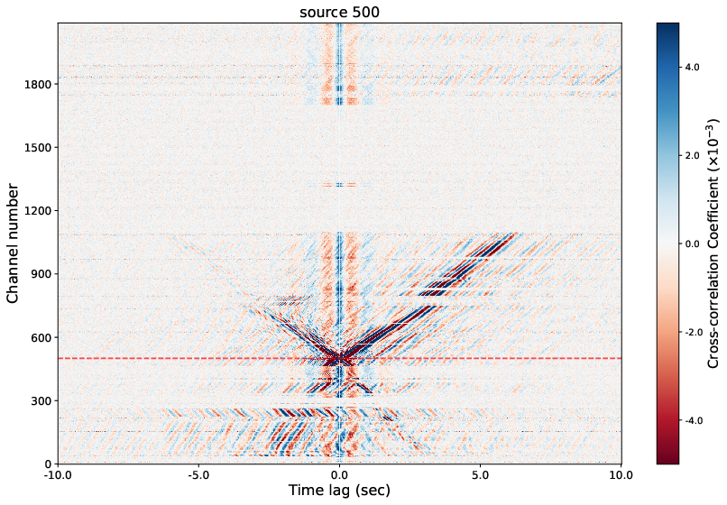

# SeaDAS-Noise cross-correlation project
## Ambient noise cross-correlation of DAS data on AWS cloud
[](https://zenodo.org/badge/latestdoi/607295205) [](https://opensource.org/licenses/MIT)[](<Redirect-URL>)


## The data: SeaDAS-N
We take the example of the SeaDAS-N DAS recording that occurred between April 2022 and March 2023 by the [UW Photonic Sensing Facility](https://psf.uw.edu). The dark fiber used is owned by the UW and runs from the Atmospheric and Geophysics building, room 211 to the UW Bothell campus. The fiber runs mostly underground but has above-ground sections we detected using Distributed Temperature and Strain Sensing. The data was collected using an OptaSense interrogator with channels every 4.78 meters and ~2000 channels, a sampling rate of 100Hz.

More information about the experiment [here](https://dasway.ess.washington.edu/vizdas/data/SeaDAS-N).

## The storage platform: DASstore
We host our DAS data in DASstore, a new storage solution for distributed acoustic sensing (DAS) data. We introduce object storage that has been widely used in commercial cloud storage (AWS S3, Azure Blob, etc.) to a local data server. Instead of hosting data in the HDF5 format, we proposed hosting DAS data in the Zarr format that is optimized for cloud environment. See [this repo](https://github.com/niyiyu/DASstore) for more information.

## The tool: NoisePy4DAS
We use a modified version of [NoisePy](https://github.com/mdenolle/NoisePy) to implement the cross-correlation operation. The package is containerized into Docker image and hosted on GitHub that can is publicly available from Cloud platform.

## AWS Batch for massive parallelization computing
* Set environment variable `JOB_ARRAY_SIZE` with the number of array size submitted to the Batch.
    ```
    ["python", "src/S1_preprocess_correlate.py"]
    ```

* Export `JOB_VERBOSE_FLAG` as `True` to print more logs.

## Results
Current results include the hourly Cross-correlation Functions (CCF) of all channel pairs, for the one month data. Figure below shows a daily stacking of the correlation function using channel 500 as the virtual source.



## Tutorial
A short tutorial is available at [notebooks/](./notebooks/example_NoisePy4DAS_SeaDAS-N.ipynb). If you have Docker, you can also pull the image from 
```bash
docker pull ghcr.io/niyiyu/noisepy4das-seadas:latest
```

Run the command to launch the Jupyter notebook from the Docker container.
```bash
docker run --rm -p 8880:8888 ghcr.io/niyiyu/noisepy4das-seadas jupyter notebook --ip 0.0.0.0
```
You would need to go to `localhost:8880` using **browser on your local computer**. Make sure no other process is using 8880 port, otherwise replace the port in the command above.